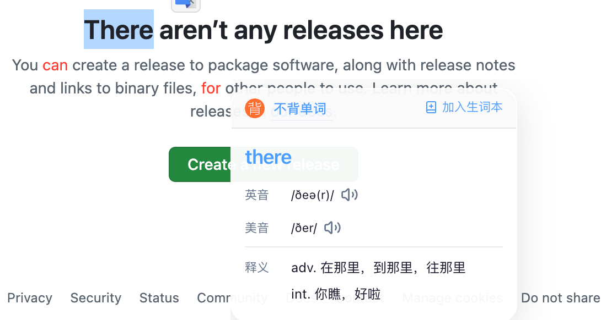
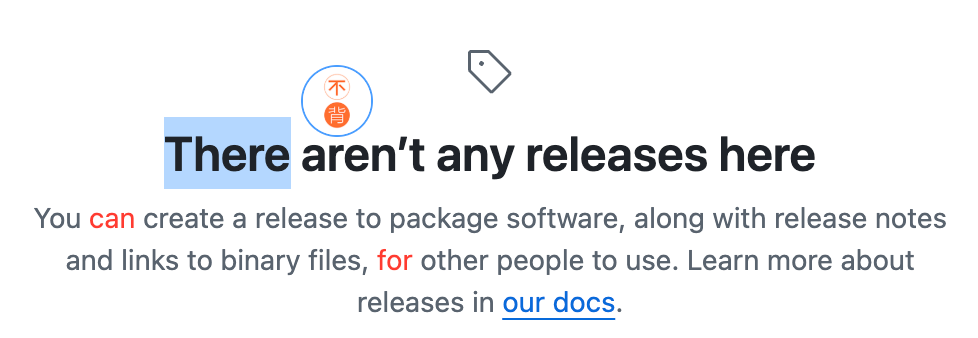
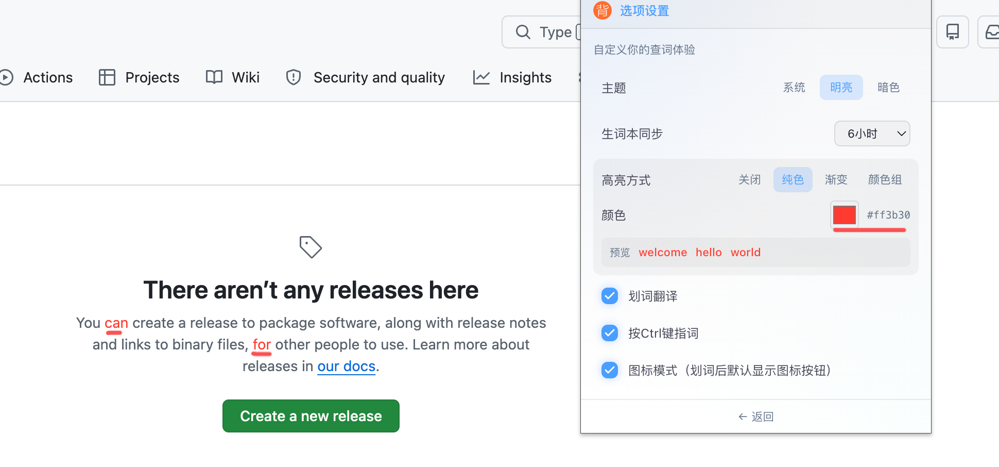

# 不背单词查词 · 使用手册

> 版本 1.0.1｜Chrome / Edge 等 Chromium 内核浏览器扩展  
> 问题反馈：[GitHub Issues](https://github.com/ilkm/irez-bbdc-plus/issues)

---

## 第一部分：产品介绍与使用指南

### 1. 产品是什么

**不背单词查词**是一款面向英语阅读场景的浏览器扩展。它把「不背单词」的查词能力、生词本能力直接带到网页里：划词即查、指词即译、生词高亮，让你在原文章节中积累词汇，而不是跳出阅读去翻词典。

适合：

- 刷英文资讯、论文、文档、Wiki 的学习者
- 已在使用「不背单词」App / 网页端、希望网页生词与云端生词本打通的用户
- 希望少打断、沉浸式阅读的人

---

### 2. 核心能力一览

| 能力 | 一句话说明 |
|------|------------|
| 划词翻译 | 选中英文单词，立刻弹出释义 |
| Ctrl 指词 | 按住 Ctrl，鼠标指向单词即可查询 |
| 图标模式 | 划词后先出悬浮图标，点击再查，更克制 |
| 工具栏查词 | 点击扩展图标，输入单词查询 |
| 生词本 | 一键加入 / 删除，与 bbdc.cn 云端同步 |
| 生词高亮 | 网页中自动标出生词本里的词，颜色可自定义 |
| 主题 | 明亮 / 暗色 / 跟随系统 |

---

### 3. 快速上手（3 分钟）

1. **安装扩展**（见第二部分）并固定到工具栏。
2. 打开扩展弹窗，点击 **登录**，在 bbdc.cn 完成登录（用于生词本同步与添加）。
3. 打开任意英文网页，**划选一个单词**，查看翻译弹窗。
4. 在弹窗中点击 **加入生词本**；之后该词会在其他页面以高亮形式出现。

---

### 4. 功能详解

#### 4.1 工具栏弹窗查词

点击浏览器工具栏上的扩展图标，即可打开查词面板：


你可以：

- 输入英文单词后回车或点「查询」
- 查看音标、释义
- 加入或删除生词本（需已登录）
- 通过底部「设置」进入选项页

> 小技巧：在网页中划词后，再打开工具栏弹窗，会自动带入刚才选中的单词并查询。

#### 4.2 划词翻译

在网页中用鼠标选中英文单词，松开后弹出释义卡片：



弹窗中可：

- 查看释义与发音
- **加入生词本** / **删除**（已在生词本中时）
- 点击「不背单词」进入官网

若释义较长，弹窗会尽量随内容增高；仅当超出屏幕较多时才出现极细滚动条。

#### 4.3 图标模式（更克制的划词）

开启「图标模式」后，划词不会立刻弹释义，而是在选区旁出现圆形悬浮图标：



点击图标后再打开翻译弹窗。适合在长文中频繁选中、但不想每次都弹窗的场景。

#### 4.4 Ctrl 指词

开启「按 Ctrl 键指词」后：

1. 按住键盘 **Ctrl**
2. 将鼠标移到目标英文单词上
3. 稍候即可看到查询结果

适合快速扫读、不想拖选文字的时候。

#### 4.5 生词本与云端同步

扩展会与 [bbdc.cn](https://bbdc.cn) 生词本联动：

- **登录成功**：立即同步云端生词本
- **刷新网页**：立即同步（若本地数量与云端一致，则跳过耗时的分页拉取）
- **加入生词本**：接口成功后才写入本地缓存
- **删除生词**：在查词结果处可删除，同步移除本地缓存与高亮
- 本地数据保存在浏览器中，**跨标签页共享**，并驱动页面高亮

请先在扩展弹窗或 [生词本页面](https://bbdc.cn/newword) 登录不背单词账号。

#### 4.6 生词高亮

同步生词本后，网页中出现在生词本里的英文单词会自动高亮，方便复习与扫读：



高亮方式可在设置中调整（见下节）。

---

### 5. 选项设置说明

在扩展弹窗底部点击「设置」，或打开选项页：


#### 主题

- **系统**：跟随操作系统明暗
- **明亮 / 暗色**：强制对应主题

#### 生词本同步

设置后台定时同步间隔（如 6 小时）。页面刷新与登录仍会即时触发同步。

#### 高亮方式

| 选项 | 说明 |
|------|------|
| 关闭 | 不高亮生词 |
| 纯色 | 所有生词同一颜色（默认） |
| 渐变 | 文字使用渐变填充，色标数量可自定义 |
| 颜色组 | 多组颜色；每组可为纯色或渐变；**同一单词始终同色** |

颜色组支持：

- 自定义组数（至少 1 组）
- 组内添加多个色标形成渐变
- 按单词哈希固定配色，刷新后颜色不变

#### 其他开关

| 选项 | 说明 |
|------|------|
| 划词翻译 | 关闭后，选中文字不再触发查询 |
| 按 Ctrl 键指词 | 关闭后，Ctrl + 悬停不再查询 |
| 图标模式 | 划词后先显示图标，点击再查 |

---

### 6. 使用建议与常见问题

**Q：划词没有反应？**  
检查：是否开启「划词翻译」；若开了「图标模式」，需再点一下悬浮图标；选区是否为英文单词（过长短语可能被忽略）。

**Q：无法加入生词本？**  
请先在弹窗中登录 bbdc.cn；确认浏览器未拦截第三方 Cookie（扩展需访问 bbdc.cn）。

**Q：高亮没有出现？**  
确认已登录并完成同步；高亮方式不是「关闭」；该词确已在生词本中；刷新页面后再看。

**Q：Ctrl 指词误触太多？**  
可在设置中关闭「按 Ctrl 键指词」，或改用图标模式。

**Q：数据安全吗？**  
查词走词典服务，生词本走不背单词官方接口；本地仅缓存单词列表用于高亮与跨页状态，不会上传你浏览的网页全文。

---

## 第二部分：技术部署与安装

### 1. 环境要求

| 项目 | 要求 |
|------|------|
| 浏览器 | Chrome / Edge / 其他 Chromium 内核浏览器（推荐最新稳定版） |
| 开发（可选） | Node.js 18+、npm |
| 账号 | 不背单词账号（生词本功能需要） |

Firefox 可通过 `npm run build:firefox` 构建，但日常以 Chromium 为主。

---

### 2. 终端用户：安装已构建扩展（推荐）

#### 方式 A：加载解压后的构建目录

1. 获取发布包（例如 CI / 维护者提供的 `chrome-mv3` 目录或 zip）。
2. 若是 zip，解压到本地文件夹。
3. 打开浏览器，访问：
   - Chrome：`chrome://extensions`
   - Edge：`edge://extensions`
4. 打开右上角 **开发者模式**。
5. 点击 **加载已解压的扩展程序**，选择构建产物目录（通常为 `.output/chrome-mv3`）。
6. 确认列表中出现 **不背单词查词**，并点击「详细信息」→ **在工具栏中显示**。

#### 方式 B：从 zip 安装（WXT zip）

维护者执行 `npm run zip` 后，可得到可分发的 zip。部分环境支持拖拽 zip 到扩展页；更稳妥的方式仍是解压后「加载已解压的扩展程序」。

#### 安装后自检

1. 打开扩展弹窗，能看到查词界面。
2. 登录 bbdc.cn，确认显示用户名。
3. 打开英文网页划词，能弹出释义。
4. 选项页可正常保存主题与高亮设置。

---

### 3. 开发者：本地开发与构建

#### 3.1 克隆与依赖

```bash
git clone https://github.com/ilkm/irez-bbdc-plus.git
cd irez-bbdc-plus   # 或你的本地目录 bbdc-plus
npm install
```

#### 3.2 开发模式（热更新）

```bash
npm run dev
```

WXT 会启动开发服务并输出扩展目录。在 `chrome://extensions` 中加载对应的开发输出目录；保存代码后一般会自动刷新，若异常可手动点「重新加载」。

Firefox 开发：

```bash
npm run dev:firefox
```

#### 3.3 生产构建

```bash
npm run build          # Chromium
npm run build:firefox  # Firefox
```

构建产物默认在：

```text
.output/chrome-mv3/
```

打包 zip：

```bash
npm run zip
npm run zip:firefox
```

仅做类型检查：

```bash
npm run compile
```

---

### 4. 权限与网络说明

扩展在清单中声明的能力如下，便于安全审计与企业环境放行：

| 类型 | 内容 | 用途 |
|------|------|------|
| `storage` | 本地存储 | 设置、生词本单词缓存 |
| `alarms` | 定时器 | 按间隔同步生词本 |
| 主机权限 | `langeasy.com.cn` | 词典查词 |
| 主机权限 | `bbdc.cn` | 登录状态、生词本读写 |
| 主机权限 | `audio2.beingfine.cn` | 发音音频 |
| 内容脚本 | `<all_urls>` | 划词 / 指词 / 高亮 |

**企业网络**：请放行上述域名的 HTTPS 访问，并允许扩展在普通网页中注入内容脚本。

---

### 5. 数据与同步机制（运维向）

```text
┌─────────────┐     sync-wordbook      ┌──────────────────┐
│ Content /   │ ─────────────────────► │ Background       │
│ Popup       │                        │ syncWordbook()   │
└─────────────┘                        └────────┬─────────┘
                                                │
                     ┌──────────────────────────┼──────────────────────────┐
                     ▼                          ▼                          ▼
              bbdc.cn API              chrome.storage.local           IndexedDB
           (云端生词本为准)              (跨页单词列表)              (明细缓存)
                     │                          │
                     │                          ▼
                     │                   页面生词高亮
                     └──────── 数量一致则跳过分页全量拉取 ────────┘
```

要点：

- **云端为准**：全量同步时用云端列表覆盖本地。
- **数量一致**：本地词数 = 云端 `totalRecord` 时，只校验不拉全部分页。
- **写本地时机**：添加 / 删除均须接口成功后再改本地缓存。
- **触发时机**：登录成功、页面加载 / 刷新、定时 alarm、手动消息。

---

### 6. 项目结构速览

```text
bbdc-plus/
├── entrypoints/
│   ├── background.ts      # 后台：同步调度、消息路由
│   ├── content.ts         # 内容脚本：划词 / Ctrl 指词 / 图标 / 弹窗
│   ├── popup/             # 工具栏查词弹窗
│   ├── options/           # 选项设置页
│   └── lookup/            # 网页内翻译弹窗（iframe）
├── components/            # UI 组件（释义、生词本操作等）
├── lib/
│   ├── api.ts             # 查词 / 登录 / 生词本 API
│   ├── wordbook-sync.ts   # 生词本同步与本地缓存
│   ├── highlight.ts       # 网页生词高亮
│   └── storage.ts         # 设置与存储定义
├── public/images/         # 扩展图标
├── docs/                  # 文档与截图
├── wxt.config.ts          # 扩展清单与构建配置
└── package.json
```

技术栈：WXT + React + TypeScript + Tailwind CSS + Dexie。

---

### 7. 更新与回滚

1. 构建新版本（或获取新产物）。
2. 在 `chrome://extensions` 中对旧扩展点击「重新加载」，或移除后重新「加载已解压的扩展程序」。
3. 用户设置与生词本本地缓存一般保留在 `chrome.storage` 中；若行为异常，可在扩展详情中清除数据后重新登录同步。

回滚：重新加载上一版本的构建目录即可。

---

### 8. 故障排查清单

| 现象 | 排查步骤 |
|------|----------|
| 扩展无法加载 | 确认选择的是含 `manifest.json` 的构建根目录；查看扩展页错误信息 |
| 查词失败 | 检查网络与 `langeasy.com.cn` 是否可达 |
| 生词本失败 | 登录 bbdc.cn；检查 Cookie / 第三方登录是否被清理 |
| 划词无效 | 确认内容脚本已注入（扩展详情 → 网站访问权限）；刷新目标页 |
| 高亮异常 | 选项中确认非「关闭」；强制刷新页面；重新同步生词本 |
| 开发热更新失效 | 在扩展页手动「重新加载」；重启 `npm run dev` |

---

### 9. 反馈渠道

- GitHub Issues：<https://github.com/ilkm/irez-bbdc-plus/issues>
- 产品内描述中的反馈入口以仓库说明为准

---

*文档随版本 1.0.1 编写。功能以实际扩展界面为准。*
